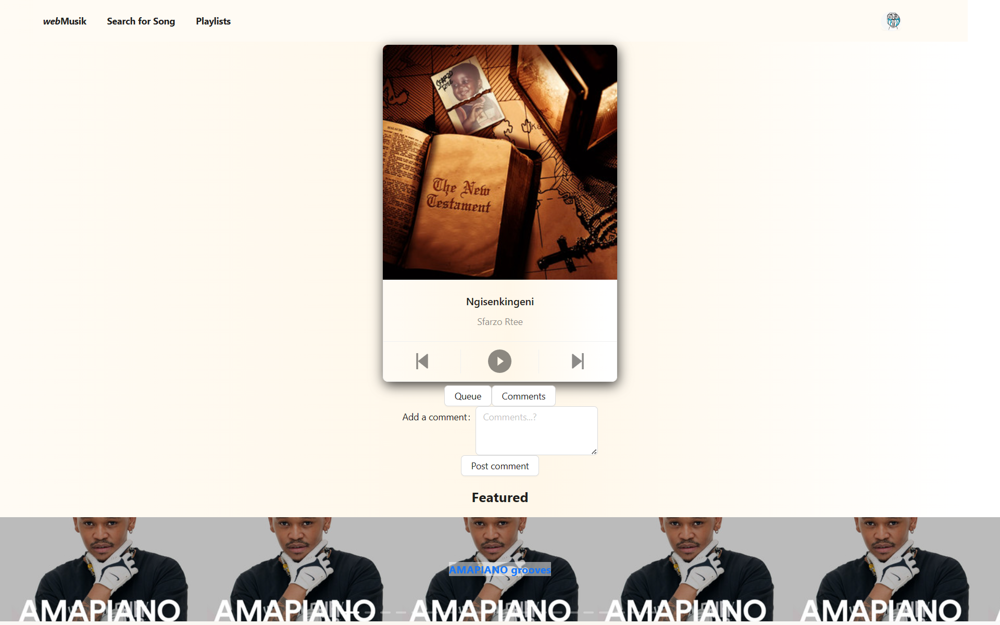
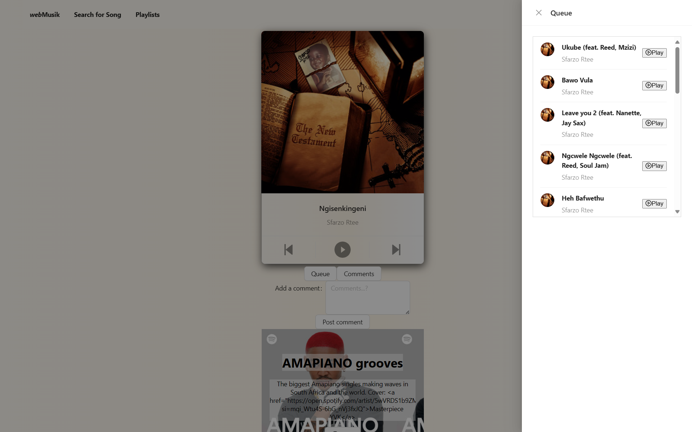
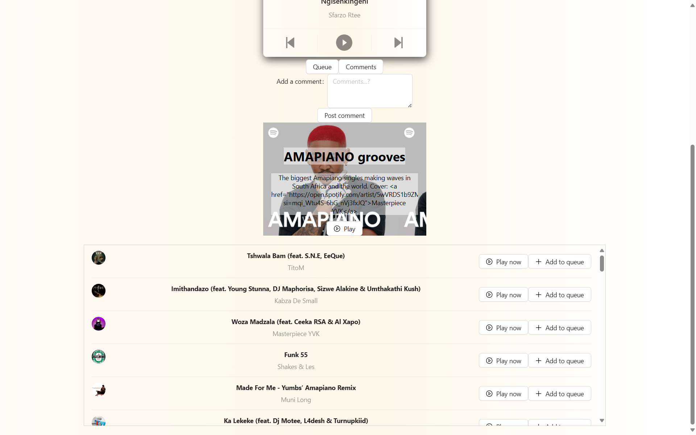

# <em>web</em>Musik

## Info

Normal users can login with their spotify account and search for songs, albums and artists.  
(Coming soon) They can also play songs and add them to their playlists.  

This project was bootstrapped with [Create React App](https://github.com/facebook/create-react-app).

## Available Scripts

In the project directory, you can run:

### `npm start`

Runs the app in the development mode.\
Open [http://localhost:3000](http://localhost:3000) to view it in your browser.

---

## Some Screenshots

  
*Welcome*

  
*Home*

  
*Queue*

  
*View Playlist*

---

## Requisites

- Spotify client id and secret keys

---

Github: @teboho/<em>web</em>Musik 
&copy; 2024 teboho  
